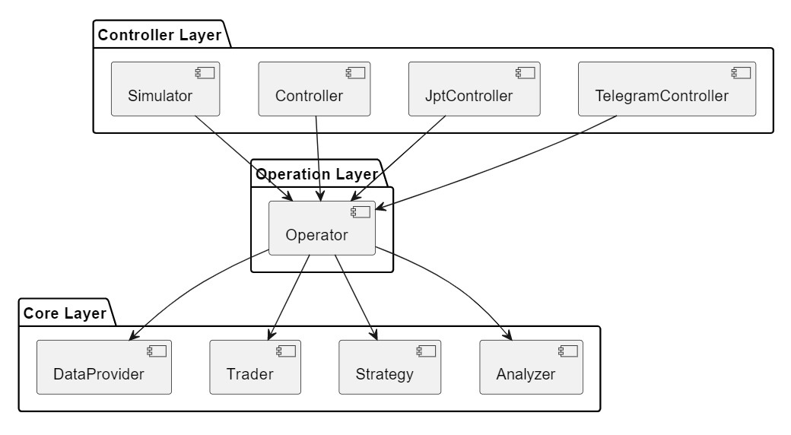
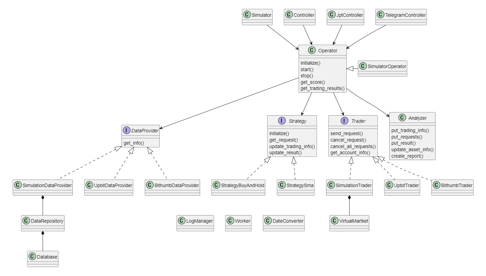
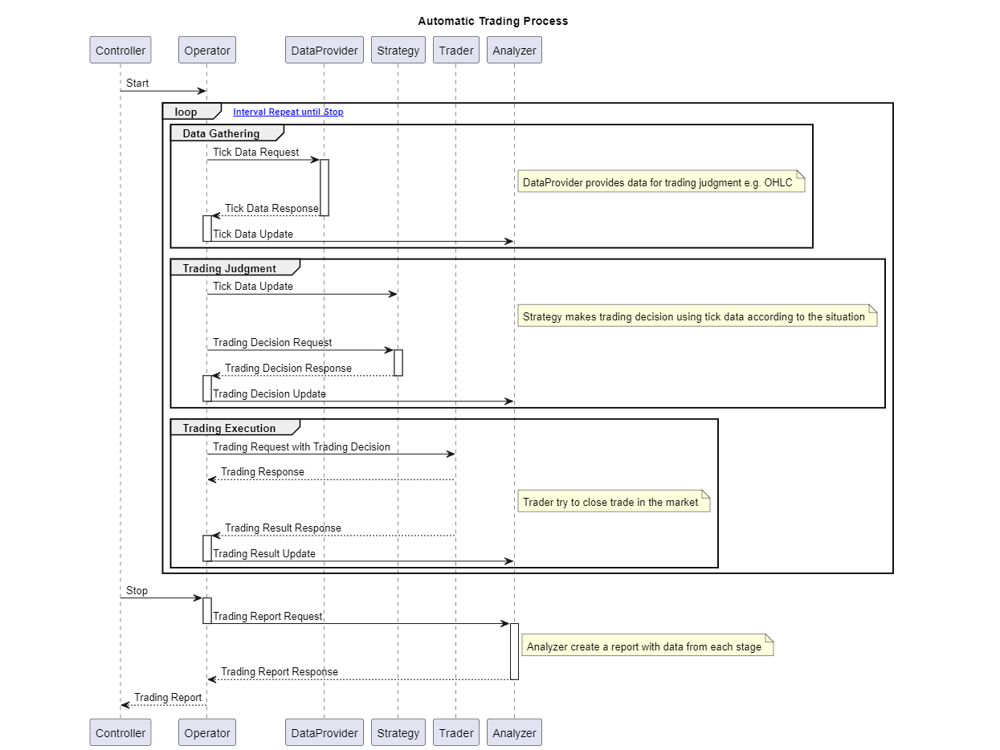

# smtm
[](https://app.travis-ci.com/github/msaltnet/smtm)
[](https://github.com/msaltnet/smtm/blob/master/LICENSE)

[](https://codecov.io/gh/msaltnet/smtm)

> It's a game to get money. 

An algorithm-based cryptocurrency automatic trading system made in Python. https://smtm.msalt.net

[한국어](https://github.com/msaltnet/smtm/blob/master/README.md) 👈

[](https://smtm.msalt.net/)

It has a very simple routine and repeat periodically.
Performance critical approach is NOT suitable. e.g. multiple tradings in seconds. If you want, find another solution.

1. Get data from Data Provider
2. Make a decision using Strategy
3. Execute a trading via Trader  
 --- repeat ---
4. Create analyzing result by Analyzer


## Features
- Simulation
- Mass-Simulation with Multi-process
- CLI mode Auto Trading
- Remote Control with Jupyter Notebook
- Telegram Message App Trading Control

### Telegram Chat-bot Mode
User can launch the program with Telegram chat-bot mode which provide user interface via Telegram chat-bot.


### Simulation Mode
User can execute simulation with Simulator or MassSimulator, which run simulations using past trading records.

## How to install
Install all packages using requirements.txt

```
pip install -r requirements.txt
```

For development, all development depedencies included.

```
pip install -r requirements-dev.txt
```

## How to run
There are 6 mode for each features.
- 0: simulator with interative mode
- 1: execute single simulation
- 2: controller for real trading
- 3: telegram chatbot controller
- 4: mass simulation with config file
- 5: make config file for mass simulation

### Interactive mode simulator
run with only mode
```
python -m smtm --mode 0
```

### Execute single simulation
run with mode and simulation setting parameters
```
python -m smtm --mode 1 --budget 50000 --from_dash_to 201220.170000-201221 --term 0.1 --strategy 0 --currency BTC
```

### Run controller for trading
run with mode and initial setting parameters
```
python -m smtm --mode 2 --budget 50000 --term 60 --strategy 0 --currency ETH
```

for real trading API key and host url is included in `.env` file.

```
UPBIT_OPEN_API_ACCESS_KEY=Your API KEY
UPBIT_OPEN_API_SECRET_KEY=Your API KEY
UPBIT_OPEN_API_SERVER_URL=https://api.upbit.com
```

### Run telegram chatbot controller for trading
run with only mode 
```
python -m smtm --mode 3
```

chat-bot api token and chat room id is needed in `.env`.

```
TELEGRAM_BOT_TOKEN=bot123456789:YOUR bot Token
TELEGRAM_CHAT_ID=123456789
```

### Execute mass simulation with config file
run with mode and config file info
```
python -m smtm --mode 4 --config /data/sma0_simulation.json
```

### Make config file for mass simulation
run with mode and simulation setting parameters
```
python -m smtm --mode 5 --budget 50000 --title SMA_6H_week --strategy 1 --currency ETH --from_dash_to 210804.000000-210811.000000 --offset 360 --file generated_config.json
```

## Architecture
Layered architecture

| Layer | Module | Role |
|:---:|:---:|:---:|
| Controller Layer | Simulator, Controller, TelegramController| User Interface |
| Operator Layer | Operator, SimulationOperator |Operating Manager |
| Core Layer |Analyzer, Trader, Strategy, Data Provider | Core Feature |

### Component Diagram



### Class Diagram



### Sequence Diagram




## How to test
### Unit test
Test project with unittest.

```
# run unittest directly
python -m unittest discover ./tests *test.py -v
```

### Integration test
Test with real trading market. Some integration tests are excuted via Jupyter notebook. It's good to run test flexible re-ordered.

You can find notebook files in `notebook` directory.

```
# run unittest directly
python -m unittest integration_tests

# or
python -m unittest integration_tests.simulation_ITG_test
```

### Tip
clear jupyter notebook output before make commit

```
jupyter nbconvert --clear-output --inplace {file.ipynb}
#jupyter nbconvert --clear-output --inplace .\notebook\*.ipynb
```

## Related Book

[](http://www.kyobobook.co.kr/product/detailViewKor.laf?mallGb=KOR&ejkGb=KOR&barcode=9788997924967)
